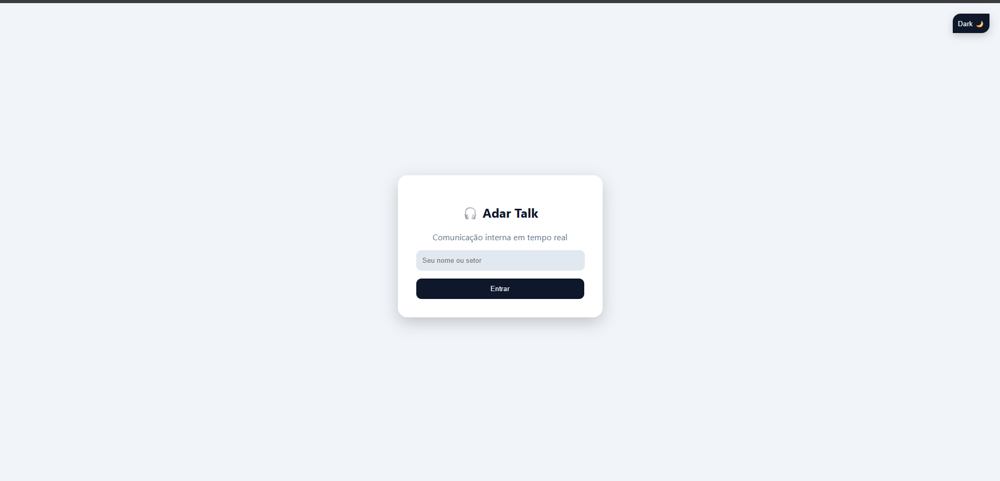
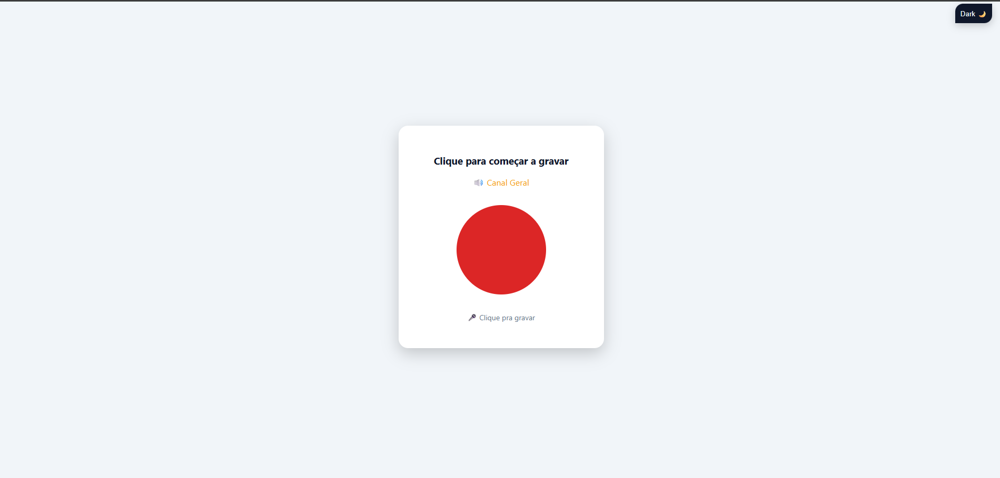
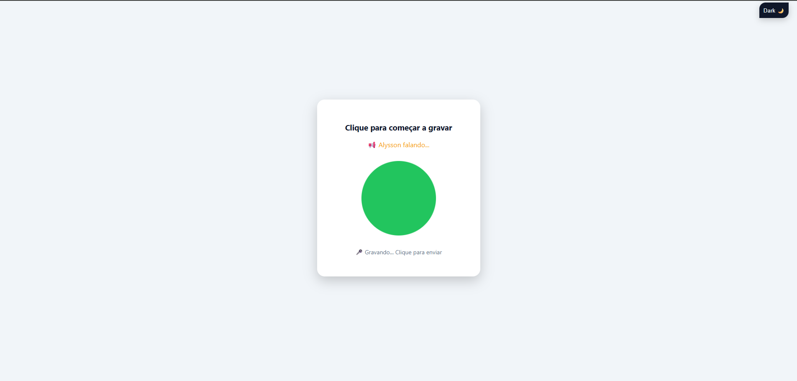

HEAD
# walk-talk
Criar uma forma de comunicação walk talk pelo navegador 

# 📻 Python Web Walkie-Talkie

Sistema de comunicação Push-to-Talk (PTT) em tempo real usando Python, Flask-SocketIO e Web Audio API.

## 🛠️ Como rodar

1. Instale as dependências: `pip install -r requirements.txt`
2. Inicie o servidor: `python app.py`
3. Acesse via HTTPS (necessário para o microfone) ou localhost.

## 🛠️ NGROK
1. Instale O app: [Ngrok](https://ngrok.com/)
2. Inicie o CMD na pasta :`\Downloads\ngrok-v3-stable-windows-amd64>`
3. ìnicie na porta 5000: `ngrok http 5000`

(Walkie-talkie funcional para tablets e PC)

🔹 Fluxo completo funcionando:

usuário informa seu nome :

usuario clica pra começar a gravar:

usuario clica pra enviar audio:
